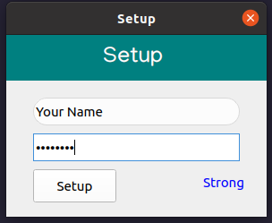
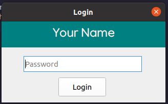
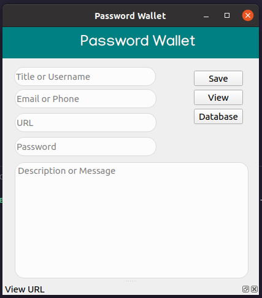
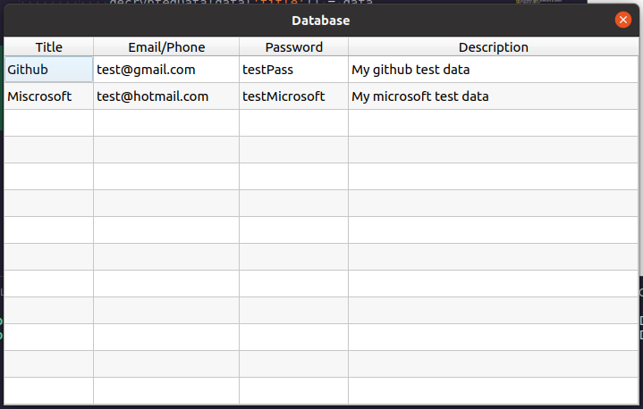
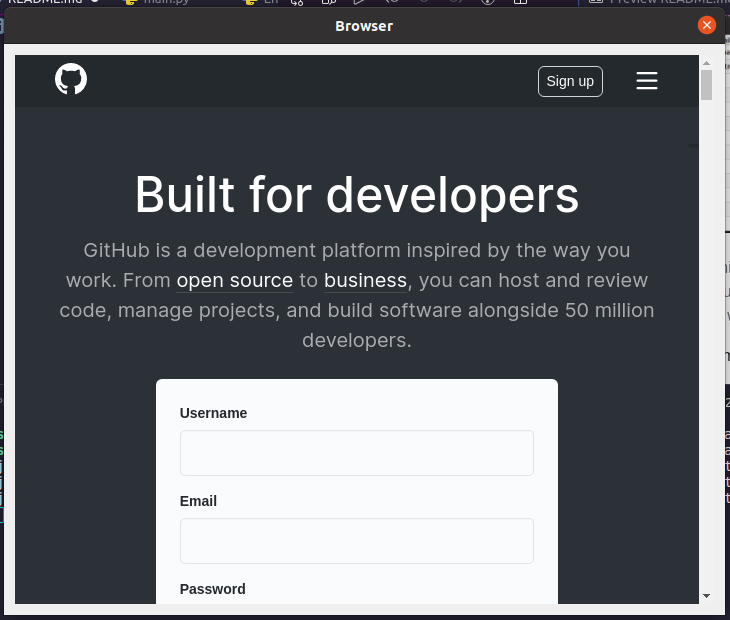

# Password-Wallet
<p>
This is a minified Qt application for keeping your passwords in 
one safe place. It provides encryption for your credentials.<br/> You 
don't have to worry any more remembering your passwords, all you'll 
have to remember is your login password and the app will do the 
rest of remebering for you. This is a safe way for creating strong passwords
for your accounts without minding if you'll forget them. <br/>
We're all humans and one of our greatest weakness is forgeting :blush:
</p>

## Setup
To download all the required dependancies copy paste the code below
``` python
pip install -r requirements.txt
```

## Usage
> On first start up the application will require you to setup your account 
> first. The setup screen will look like so <br/>


<br/>

> The app has a helper to show your the level of security your password holds. 
> After setting up, the app will save your credentials then direct you to 
> the login page.<br/>


<br/>

> After a successful login, you'll be presented with the following screen where 
> you can now save you credentials<br />


<br/>

> you can also check your saved credentials when you click
> on the database button



> it also ships in with a lightweight browser which 
> launches the url of the related with the data
> when the Title is clicked <br/>


<br/>

### Contact
You can get in touch with me at <br />
* [Twitter](https://twitter.com/machel_dev)
* [Instagram](https://www.instagram.com/pydevjnr/)

for more code documentation [Code Documentation](https://github.com/SamoraMachel/Password-Wallet.wiki.git)